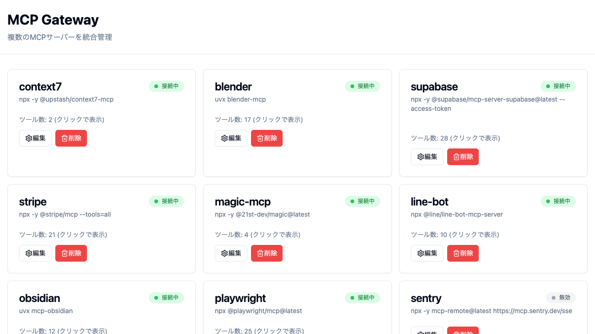
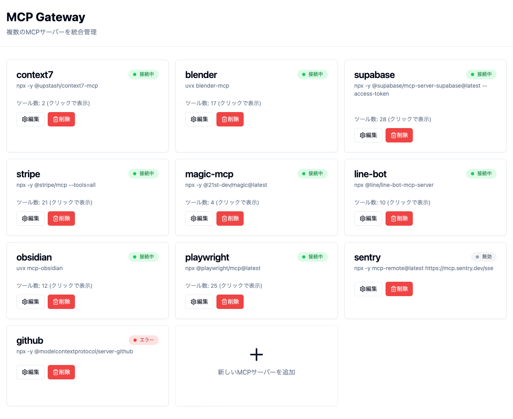
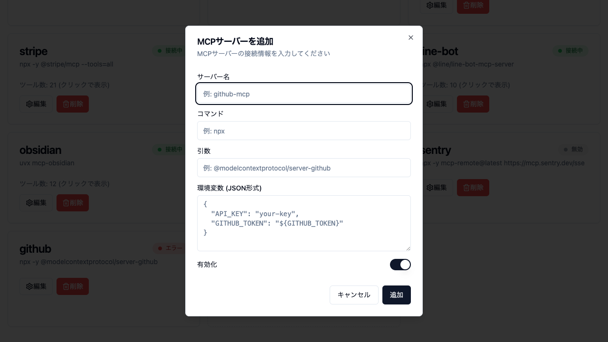
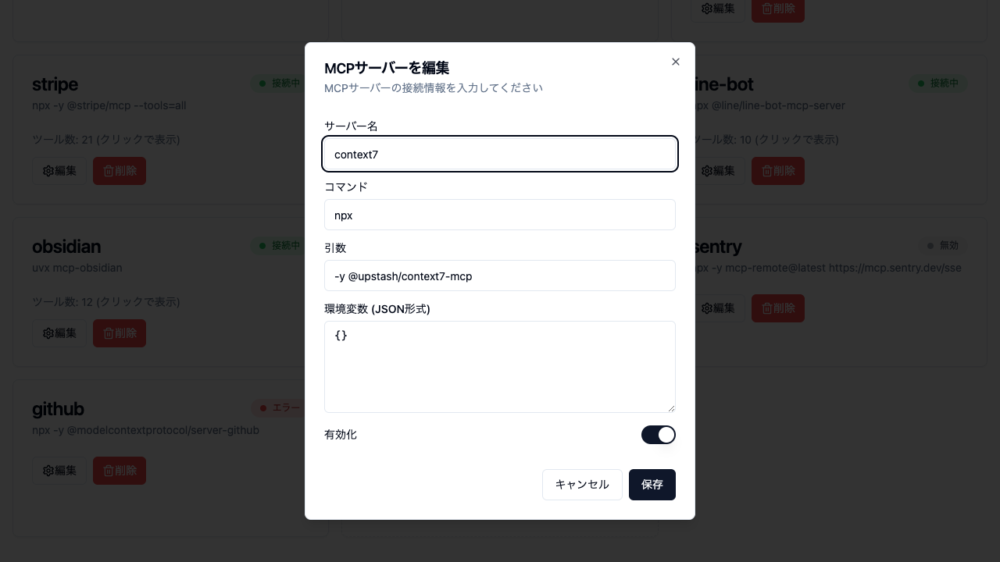

# MCP Gateway

複数のMCPサーバーを統合管理する高機能ゲートウェイシステム

<div align="center">
  
  <p><em>MCP Gateway - 複数のMCPサーバーを一元管理</em></p>
</div>

## ✨ 主な特徴

| 機能 | 説明 |
|------|------|
| 🔌 **統合管理** | 複数のMCPサーバーを1つのゲートウェイで管理 |
| 🎨 **Web UI** | 直感的な管理画面でサーバーの追加・編集・削除が可能 |
| 🐳 **Docker対応** | コンテナ環境での運用に最適化 |
| 🔄 **リアルタイム監視** | 各MCPサーバーの状態を常時監視 |
| 🛠️ **柔軟な設定** | JSON設定ファイルとWeb UIの両方から設定可能 |
| 🌐 **ホスト連携** | Docker内からホストのMCPサーバーも利用可能 |

## 🚀 クイックスタート

### 必要な環境

- Bun v1.0以上
- Docker & Docker Compose

### セットアップ手順


#### 1️⃣ プロキシサーバーを起動（別ターミナル）

```bash
bun install
bun run proxy
```

✅ ポート9999でWebSocketプロキシが起動

#### 2️⃣ Docker Composeで起動

```bash
docker-compose up
```

✅ MCP GatewayサーバーとWeb UIが起動

#### 3️⃣ Web UIにアクセス

ブラウザで http://localhost:3002 を開く

✅ MCPサーバーの管理画面が表示

## 📱 Claude への登録

### Claude Desktop

`~/Library/Application Support/Claude/claude_desktop_config.json` に追加：

```json
{
  "mcpServers": {
    "gateway": {
      "command": "docker",
      "args": [
        "exec",
        "-i",
        "shared-mcp-gateway-server",
        "bun",
        "server/index.ts"
      ]
    }
  }
}
```

### Claude Code

```bash
claude mcp add -s user gateway -- docker exec -i shared-mcp-gateway-server bun server/index.ts
```

## 🔧 システム構成

### アーキテクチャ概要

```
┌─────────────────┐
│ Claude Desktop  │
└────────┬────────┘
         │ stdio
         ▼
┌─────────────────┐                    ┌──────────────┐
│  Gateway MCP    │                    │  MCP管理用    │
│     Server      │      HTTP API      │    Web UI    │
│                 │◀───localhost:3003──│  localhost   │
└────────┬────────┘                    │    :3002     │
                                       └──────────────┘
         │
    WebSocket
 ws://localhost:9999
         │
┌────────▼────────┐
│  MCP Proxy      │
│    Server       │
└────────┬────────┘
         │
    ┌────┴────┐
    │  spawn  │
┌───▼───┐ ┌───▼───┐
│  MCP  │ │  MCP  │
│Server1│ │Server2│ ・・・
└───────┘ └───────┘
```

### ポート一覧

| サービス | ポート | 説明 |
|---------|-------|------|
| プロキシ | ws://localhost:9999 | MCPサーバーとの通信 |
| API | http://localhost:3003 | ゲートウェイAPI |
| Web UI | http://localhost:3002 | 管理画面 |

## 💻 Web UI の機能

### メイン画面

<div align="center">
  
  <p><em>すべてのMCPサーバーを一覧で管理</em></p>
</div>

### 主な機能

#### 🆕 MCPサーバーの追加

<div align="center">
  
  <p><em>「新しいMCPサーバーを追加」ボタンから簡単に追加</em></p>
</div>

- サーバー名、コマンド、引数を指定
- 環境変数の設定も可能
- 追加後は即座にmcp-config.jsonに反映

#### ✏️ MCPサーバーの編集

<div align="center">
  
  <p><em>既存のMCPサーバー設定を編集</em></p>
</div>

- 設定の変更が即座に反映
- 環境変数の追加・変更も可能

#### その他の機能

- 📊 **ステータス表示**: 各MCPサーバーの接続状態をリアルタイムで確認
- 🔧 **ツール数表示**: 各MCPサーバーが提供するツール数を表示
- 🗑️ **削除**: 不要なMCPサーバーを削除
- 🔄 **有効/無効の切り替え**: MCPサーバーの有効/無効を切り替え

## 🔗 他のプロジェクトとの統合

### 方法1: 拡張ファイルを使用

```bash
docker-compose -f docker-compose.yml -f docker-compose.mcp.yml up
```

### 方法2: integrate.tsを使用（自動統合）

```bash
./integrate.ts ./your-docker-compose.yml
```

これにより:
- プロジェクトごとのMCP Gatewayサービスを削除
- 共有MCP Gatewayサーバー (`shared-mcp-gateway-server`) を使用
- 共有ネットワーク (`shared-mcp-network`) で接続

## 🎯 ホストマシンのMCPサーバーを使用

MCP Gatewayは、Docker環境内からホストマシンにインストールされたMCPサーバーを利用することも可能です。

### 利点

- **リソース効率**: すでにホストにインストール済みのMCPサーバーを再利用
- **統一管理**: Docker内外のMCPサーバーを一元管理
- **柔軟性**: 環境に応じて最適な構成を選択可能

### 設定例

`mcp-config.json` でホストのMCPサーバーを指定：

```json
{
  "mcpServers": {
    "host-github": {
      "command": "/usr/local/bin/npx",
      "args": ["-y", "@modelcontextprotocol/server-github"],
      "env": {
        "GITHUB_TOKEN": "your-token"
      },
      "enabled": true
    }
  }
}
```

プロキシサーバーがホストで実行されているため、ホストにインストールされたコマンドやツールをそのまま利用できます。

## 📝 設定ファイル

### mcp-config.json

MCPサーバーの設定を管理。Web UIから編集することも可能。

#### 基本構造

```json
{
  "mcpServers": {
    "サーバー名": {
      "command": "実行コマンド",
      "args": ["引数1", "引数2"],
      "env": {
        "環境変数名": "値"
      },
      "enabled": true/false  // サーバーの有効/無効を制御
    }
  }
}
```

#### enabledフィールドについて

`enabled` フィールドは、MCPサーバーの有効/無効を制御する重要な設定です：

- **`enabled: true`** - サーバーが有効化され、MCP Gatewayが起動時に自動的に接続
- **`enabled: false`** - サーバーは設定に残るが、起動されない（一時的に無効化したい場合に便利）

```json
// 例：開発中は有効、本番環境では無効にしたいサーバー
"debug-server": {
  "command": "npx",
  "args": ["debug-mcp-server"],
  "enabled": false  // 本番では無効化
}
```

#### 実際の設定例

```json
{
  "mcpServers": {
    "github": {
      "command": "npx",
      "args": ["-y", "@modelcontextprotocol/server-github"],
      "env": {
        "GITHUB_TOKEN": "your-github-token"
      },
      "enabled": true
    },
    "stripe": {
      "command": "npx",
      "args": ["-y", "@stripe/mcp", "--tools=all"],
      "env": {
        "STRIPE_SECRET_KEY": "sk_test_..."
      },
      "enabled": true
    },
    "obsidian": {
      "command": "uvx",
      "args": ["mcp-obsidian"],
      "env": {
        "OBSIDIAN_API_KEY": "your-api-key",
        "OBSIDIAN_HOST": "localhost:27123"
      },
      "enabled": false
    }
  }
}
```

### 設定可能なMCPサーバー例

| サーバー | 説明 | 必要な環境変数 |
|---------|------|---------------|
| 📦 GitHub | GitHubリポジトリ操作 | `GITHUB_TOKEN` |
| 💳 Stripe | 決済処理 | `STRIPE_SECRET_KEY` |
| 📝 Obsidian | ノート管理 | `OBSIDIAN_API_KEY` |
| 🎭 Playwright | ブラウザ自動化 | なし |
| 🔮 Magic MCP | UI生成 | `API_KEY` |
| 💬 LINE Bot | LINE通知 | `CHANNEL_ACCESS_TOKEN` |

### 💡 enabledフィールドの活用例

#### 1. 環境別の設定

```json
{
  "mcpServers": {
    "production-db": {
      "enabled": true  // 本番環境では有効
    },
    "test-db": {
      "enabled": false // 本番環境では無効
    }
  }
}
```

#### 2. 一時的な無効化

```json
{
  "mcpServers": {
    "stripe": {
      "enabled": false  // メンテナンス中は一時的に無効化
    }
  }
}
```

#### 3. Web UIからの切り替え

Web UIの「有効/無効」ボタンをクリックすることで、`enabled` フィールドが自動的に更新されます。サーバーの再起動は不要で、即座に反映されます。

## 🆘 トラブルシューティング

### プロキシサーバーが起動しない

```bash
# ポートが使用中か確認
lsof -i :9999

# プロセスを終了してから再起動
kill -9 [PID]
bun run proxy
```

### Docker コンテナが起動しない

```bash
# コンテナを完全に削除してから再起動
docker-compose down -v
docker-compose up --build
```

### Web UIにアクセスできない

```bash
# ポートが正しく開いているか確認
docker-compose ps
```